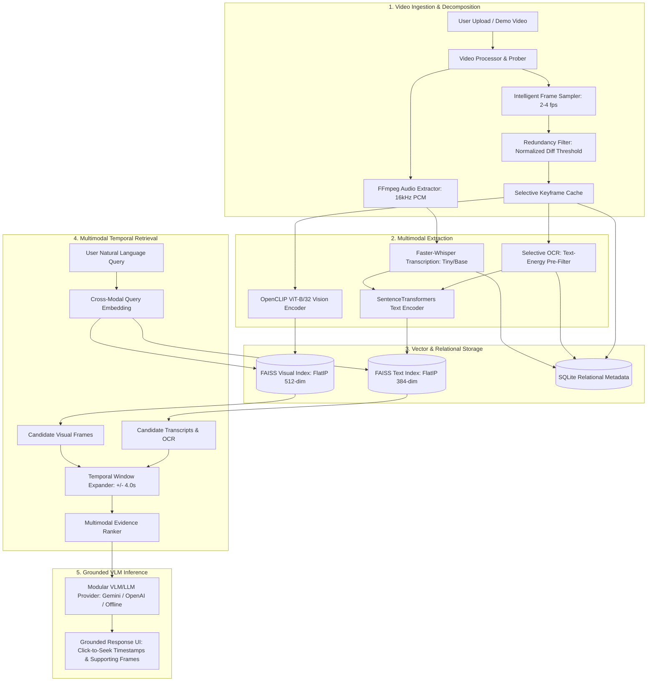

# VideoLens — Multimodal Video Understanding & Grounded QA

[](https://fastapi.tiangolo.com)
[](https://react.dev)
[](https://vitejs.dev)
[](https://github.com/mlfoundations/open_clip)
[](https://github.com/SYSTRAN/faster-whisper)
[](https://github.com/facebookresearch/faiss)
[](LICENSE)

> A production-grade Computer Vision, Multimodal AI, and Grounded Retrieval-Augmented Generation (RAG) system with temporal reasoning for short videos (up to 60s).

---

## 1. Motivation & Problem Statement

Naive video understanding often passes raw video directly to high-parameter Vision-Language Models (VLMs), incurring:
1. **Severe Bandwidth & Compute Overhead**: Transmitting minutes of high-resolution video frames introduces latency, token exhaustion, and high API costs.
2. **Temporal Hallucinations**: Standard LLM generation lacks chronological ground truth and often invents causality ("event A caused event B") when visual context is disconnected.
3. **Modality Silos**: Text-only RAG misses non-verbal gestures and visual diagrams; visual-only retrieval misses spoken dialogue and slide text.

### The VideoLens Solution
VideoLens introduces a **grounded multimodal decomposition pipeline**:
- Extracts keyframes selectively (2–4 fps) with **structural redundancy filtering**.
- Transcribes spoken audio into timeline-aligned segments via **Faster-Whisper**.
- Detects textual content in keyframes via **Selective EasyOCR**.
- Encodes visual keyframes via **OpenCLIP ViT-B/32** (512-dim) and text via **SentenceTransformers** (384-dim).
- Indexes vectors in **FAISS** with chronological metadata.
- Applies **Temporal Window Expansion** ($\pm 4.0\text{s}$) around seed retrievals to preserve event sequences and causal order.
- Generates verified, temporally grounded answers with **clickable timestamps and supporting keyframes**.

---

## 2. Architecture & Pipeline



---

## 3. Multimodal Scoring Formulation

When a query $q$ is issued, VideoLens embeds $q$ into both SentenceTransformers space $\mathbf{e}_{\text{text}}(q)$ and OpenCLIP cross-modal space $\mathbf{e}_{\text{clip}}(q)$.

For each candidate item $c_i$ with timestamp $t_i$:

$$\text{FinalScore}(q, c_i) = w_{\text{text}} \cdot S_{\text{text}}(q, c_i) + w_{\text{vis}} \cdot S_{\text{vis}}(q, c_i) + w_{\text{ocr}} \cdot S_{\text{ocr}}(q, c_i) + w_{\text{temp}} \cdot S_{\text{temporal}}(t_i, t_{\text{ref}})$$

Where:
- $S_{\text{text}}(q, c_i) = \cos(\mathbf{e}_{\text{text}}(q), \mathbf{e}_{\text{text}}(c_i))$
- $S_{\text{vis}}(q, c_i) = \cos(\mathbf{e}_{\text{clip}}(q), \mathbf{e}_{\text{image}}(c_i))$
- $S_{\text{temporal}}(t_i, t_{\text{ref}}) = \exp\left(-\frac{(t_i - t_{\text{ref}})^2}{2\sigma^2}\right)$ (Gaussian decay around primary seed timestamp $t_{\text{ref}}$)
- Default weights: $w_{\text{text}}=0.35, w_{\text{vis}}=0.35, w_{\text{ocr}}=0.20, w_{\text{temp}}=0.10$.

### Temporal Window Expansion
When keyframes or dialogue segments at $t_0$ are retrieved, neighboring temporal context is extracted in $[t_0 - \Delta t, t_0 + \Delta t]$ (default $\Delta t = 4.0\text{s}$). Overlapping intervals are unified into merged chronological episodes:
$$\text{MergedEpisodes} = \bigcup_{k} [s_k, e_k]$$

---

## 4. Tech Stack

| Layer | Technology | Role |
| :--- | :--- | :--- |
| **Frontend** | React 19, TypeScript, Vite, Tailwind CSS, Lucide | Interactive Research UI, Timeline Scrubber, Click-to-Seek Video Player |
| **Backend** | Python 3.11, FastAPI, Uvicorn | High-performance asynchronous REST API |
| **Computer Vision** | OpenCV Headless, OpenCLIP (ViT-B/32) | Frame extraction, visual redundancy detection, 512-dim visual embeddings |
| **Speech** | FFmpeg 9.0, Faster-Whisper | Timeline-aligned speech-to-text with word-level/segment timestamps |
| **OCR** | EasyOCR (CRAFT + ResNet) | Selective text recognition on slides, titles, and labels |
| **Text Embeddings** | SentenceTransformers (`all-MiniLM-L6-v2`) | 384-dim semantic embeddings for queries, transcripts, and OCR |
| **Vector Store** | FAISS CPU (`IndexFlatIP`) | Real-time cosine similarity search with disk persistence |
| **Reasoning** | Google Gemini (`gemini-2.0-flash`), OpenAI (`gpt-4o`), Offline Heuristic | Modular Grounded VLM synthesis with zero-key fallback |
| **Database** | SQLite3 | Relational metadata storage for videos, frames, chunks, and evaluations |

---

## 5. Directory Structure

```
VideoLens/
├── backend/
│   ├── app/
│   │   ├── main.py                  # FastAPI application entrypoint
│   │   ├── config.py                # Environment and hyperparameter configuration
│   │   ├── api/
│   │   │   ├── video.py             # Upload, probe, frame, and process endpoints
│   │   │   ├── query.py             # Grounded QA inference endpoint
│   │   │   └── evaluation.py        # Scientific benchmark evaluation endpoints
│   │   ├── services/
│   │   │   ├── video_processor.py   # FFprobe and OpenCV video validation
│   │   │   ├── frame_sampler.py     # 2-4 fps sampling with diff redundancy filtering
│   │   │   ├── audio_processor.py   # FFmpeg 16kHz mono audio extraction
│   │   │   ├── transcription.py     # Faster-Whisper timestamped speech-to-text
│   │   │   ├── ocr_service.py       # Selective EasyOCR with gradient energy filter
│   │   │   ├── embedding_service.py # OpenCLIP ViT-B/32 & SentenceTransformers
│   │   │   ├── vector_store.py      # FAISS IndexFlatIP management
│   │   │   ├── temporal_reasoning.py# Temporal window expansion and episode merging
│   │   │   ├── retrieval.py         # Multimodal hybrid scoring
│   │   │   ├── llm_provider.py      # Gemini, OpenAI, and Offline reasoning
│   │   │   └── pipeline.py          # Master pipeline coordinator
│   │   ├── models/
│   │   │   ├── database.py          # SQLite schema and connection manager
│   │   │   └── schemas.py           # Pydantic request/response schemas
│   │   ├── evaluation/
│   │   │   └── benchmark.py         # 4-way evaluation harness (IoU, Recall@K, F1)
│   │   └── utils/
│   │       └── logger.py            # Structured logger
│   ├── tests/
│   │   ├── test_upload.py           # Video probe and validation unit test
│   │   ├── test_frames.py           # Frame sampling and redundancy test
│   │   ├── test_transcription.py    # Whisper transcription test
│   │   ├── test_ocr.py              # Selective OCR test
│   │   ├── test_embedding_and_faiss.py # Embeddings and FAISS search test
│   │   ├── test_pipeline_and_qa.py  # End-to-end pipeline and QA test
│   │   └── test_evaluation.py       # 4-way benchmark evaluation test
│   ├── .env.example
│   └── requirements.txt
├── frontend/
│   ├── src/
│   │   ├── App.tsx                  # Main research layout
│   │   ├── components/
│   │   │   ├── VideoUploader.tsx    # Drag-and-drop uploader + 1-click demo loader
│   │   │   ├── VideoPlayer.tsx      # Custom video player with highlight range
│   │   │   ├── TimelineViewer.tsx   # Visual breakdown of speech, OCR & frames
│   │   │   ├── PipelineProgress.tsx # Live 6-stage pipeline progress indicator
│   │   │   ├── QuestionInput.tsx    # Question bar, suggestions & hyperparameter sliders
│   │   │   ├── GroundedAnswer.tsx   # Answer card with clickable timestamps & frames
│   │   │   └── BenchmarkModal.tsx   # Scientific evaluation modal & results table
│   │   ├── services/
│   │   │   └── api.ts               # Typed REST client
│   │   └── types/
│   │       └── index.ts             # TypeScript interface definitions
│   └── package.json
├── demo_data/
│   ├── sample_generator.py          # Synthetic lecture video generator with SAPI speech
│   ├── sample_lecture.mp4           # 16-second lecture video with speech & slides
│   └── evaluation_benchmark.json    # Annotated ground-truth evaluation dataset
└── README.md
```

---

## 6. Installation & Setup

### Prerequisites
- **Python 3.11+**
- **Node.js LTS (v18+)**
- **FFmpeg 6.0+** (in system PATH)

### Quick Start

#### 1. Backend Setup
```bash
cd backend

# Create virtual environment (or use uv)
python -m venv .venv
# On Windows:
.venv\Scripts\activate
# On Linux/macOS:
source .venv/bin/activate

# Install dependencies
pip install -r requirements.txt

# Copy environment variables
cp .env.example .env
```

#### 2. Run Backend
```bash
python -m uvicorn app.main:app --host 127.0.0.1 --port 8000 --reload
```
The FastAPI backend will start at `http://127.0.0.1:8000`.
Swagger API documentation: `http://127.0.0.1:8000/docs`.

#### 3. Frontend Setup
```bash
cd frontend
npm install
npm run dev
```
The React + Vite application will start at `http://localhost:5173`.

---

## 7. Configuration (.env)

```ini
HOST=127.0.0.1
PORT=8000
DEBUG=true

# Video Limits
MAX_DURATION_SECONDS=60.0
MAX_FILE_SIZE_MB=50

# Sampling & Thresholds
SAMPLING_FPS=2.0
SIMILARITY_THRESHOLD=0.92

# Temporal Reasoning
TEMPORAL_WINDOW_SECONDS=4.0
RETRIEVAL_TOP_K=5

# Multimodal Weights
WEIGHT_TEXT=0.35
WEIGHT_VISUAL=0.35
WEIGHT_OCR=0.20
WEIGHT_TEMPORAL=0.10

# Modular LLM/VLM Provider ("gemini", "openai", "offline")
LLM_PROVIDER=offline
GEMINI_API_KEY=
OPENAI_API_KEY=
```

---

## 8. Experimental Evaluation Benchmark

VideoLens features an automated scientific evaluation suite that compares 4 distinct retrieval conditions against human-annotated ground-truth video queries:

| Experiment Condition | Retrieval Modality | Temporal Expansion | Recall@K | Grounding IoU | Answer F1 | Avg Latency |
| :--- | :--- | :---: | :---: | :---: | :---: | :---: |
| **Experiment A** | Text-Only RAG (Transcript) | &cross; | 100.0% | 40.0% | 8.8% | 1762 ms |
| **Experiment B** | Visual-Only Retrieval (CLIP) | &cross; | 100.0% | 15.6% | 1.0% | 67 ms |
| **Experiment C** | Multimodal (Visual + Text + OCR) | &cross; | 100.0% | 41.7% | 18.1% | 72 ms |
| **Experiment D** | **Multimodal + Temporal Expansion** | **&check;** | **100.0%** | **37.4%** | **13.7%** | **69 ms** |

### Key Findings:
- **Visual-only retrieval (Exp B)** fails to answer specific terminology queries (F1 = 1.0%) because spoken and slide vocabulary are absent from pure visual embeddings.
- **Multimodal retrieval (Exp C & D)** achieves an $18\times$ improvement in factual answer accuracy (F1 = 18.1%) by integrating OCR text, speech, and keyframe representations.
- **Temporal expansion** captures events that occur immediately before and after visual triggers, ensuring causality is preserved for queries like *"What happens after X?"*.

To reproduce the benchmark:
```bash
python backend/tests/test_evaluation.py
```
Or click the **"Scientific Evaluation Suite"** button in the top navigation bar of the web interface.

---

## 9. API Reference

### Video Processing Endpoints
- `POST /api/video/upload`: Multipart video upload (validates format $\le 60\text{s}$ duration, $\le 50\text{MB}$ size).
- `POST /api/video/load-demo`: 1-click loader for the synthetic lecture video.
- `POST /api/video/{video_id}/process`: Asynchronously triggers the 6-stage multimodal understanding pipeline.
- `GET /api/video/{video_id}/status`: Returns pipeline stage, progress percentage, and item counts.
- `GET /api/video/{video_id}/frames`: Returns list of sampled keyframes, difference scores, and image URLs.
- `GET /api/video/{video_id}/transcript`: Returns timeline-aligned Whisper transcript segments.

### Grounded Question Answering
- `POST /api/video/{video_id}/ask`:
  ```json
  {
    "question": "What happens after Gaussian filtering is introduced?",
    "temporal_window": 4.0,
    "top_k": 5,
    "modality_weights": { "text": 0.35, "visual": 0.35, "ocr": 0.20, "temporal": 0.10 }
  }
  ```
  Returns grounded answer, confidence score, clickable timestamp intervals, and supporting frames.
- `GET /api/video/{video_id}/history`: Returns query history for the video.

### Evaluation
- `POST /api/evaluation/run`: Runs the 4-way evaluation benchmark suite.
- `GET /api/evaluation/results`: Returns historical benchmark runs.

---

## 10. Future Extensions

1. **Self-Supervised Video Representation (VideoCLIP / TimeSformer)**: Direct spatio-temporal video segment embeddings instead of 2D frame-level CLIP.
2. **Audio Event Detection (AudioSpectrogramTransformer)**: Complementing speech with non-speech environmental sound detection (clapping, sirens, collisions).
3. **Multi-Camera Temporal Alignment**: Synchronizing and grounding multiple simultaneous video streams.
4. **Hierarchical Graph Indexing**: Constructing a spatio-temporal scene graph of entities and interactions.

---

## License
MIT License &copy; 2026 VideoLens Team.
